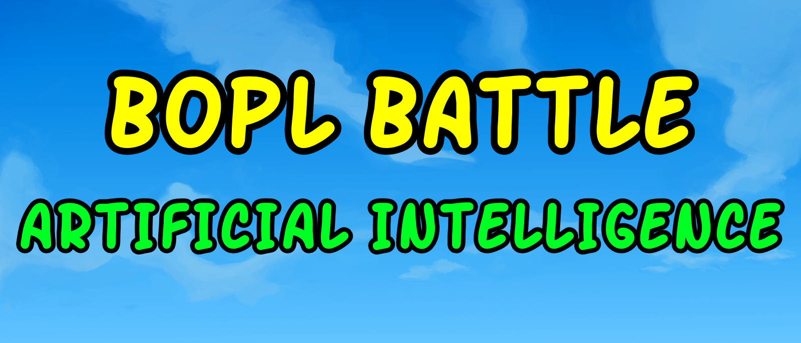

# AI Bopl Battle Mod

## Overview
The AI Bopl Battle Mod is an mod for Bopl Battle, allowing players to compete against AI opponents in the popular Bopl game.

## How to Play
1. **Installation**: Install the AI Bopl Battle Mod alongside your existing Bopl Battle game.
2. **Launch**: Launch the Bopl Battle game with the AI Bopl Battle Mod enabled.
3. **Select Game**: Choose the "Play" mode from the game menu.
4. **Choose AI Opponent**: Add a second player by tapping the "Click to join!" button, then select the AI's abilites.
5. **Play**: Start the game and engage in a non-challenging match against the AI opponent.

## Available AI Opponents
The AI Bopl Battle Mod offers a variety of AI opponents with different difficulty levels. Players can choose from:

- **Stupid AI**: Suitable for new players or those looking for a casual experience.
- **Random AI**: Suitable for new players or those looking for a casual experience.

## Development
The AI Bopl Battle Mod is open-source and welcomes contributions from the community. If you're interested in contributing to the development of new AI opponents or improving existing ones, feel free to fork the repository and submit pull requests.

## Requirements
- Bopl Battle game (version 2.2.0 or higher)
- Compatible operating system (Windows, Linux.)

## Installation
1. Download the AI Bopl Battle Mod from the official repository.
2. Extract the mod files into the Plugin folder in the Bopl Battle game directory.
3. Launch the game and play using the play tab.

## Feedback and Support
If you encounter any issues while using the AI Bopl Battle Mod or have suggestions for improvements, please don't hesitate to reach out to the development team. You can submit bug reports, feature requests, or general feedback through the official repository's issue tracker.

## License
The AI Bopl Battle Mod is licensed under the [MIT License](https://opensource.org/licenses/MIT). You are free to use, modify, and distribute the mod for both personal and commercial purposes, subject to the terms of the license.
